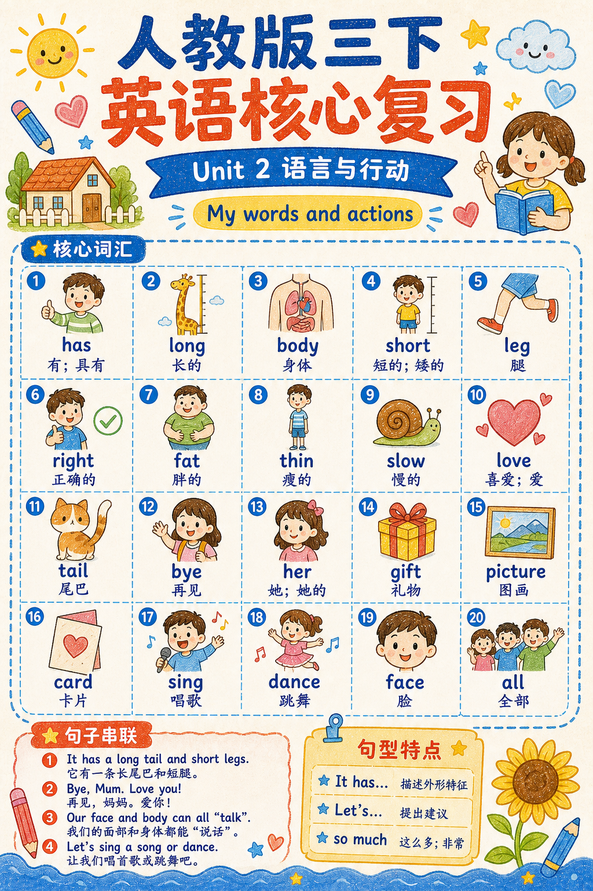
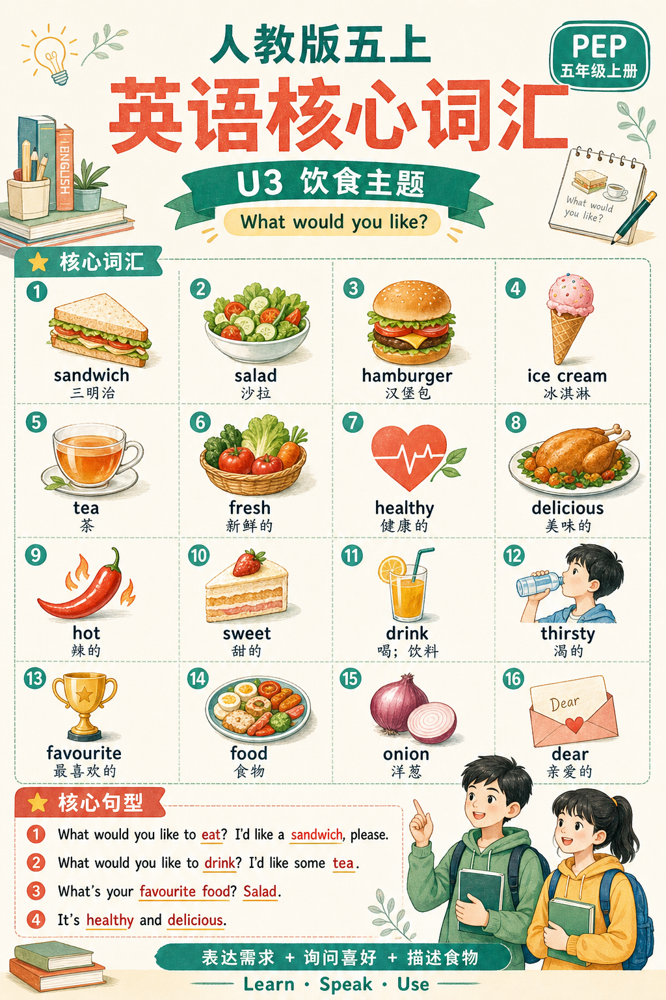
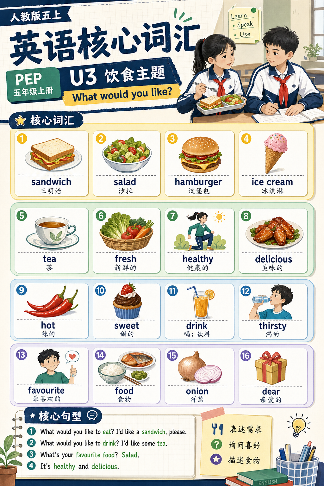
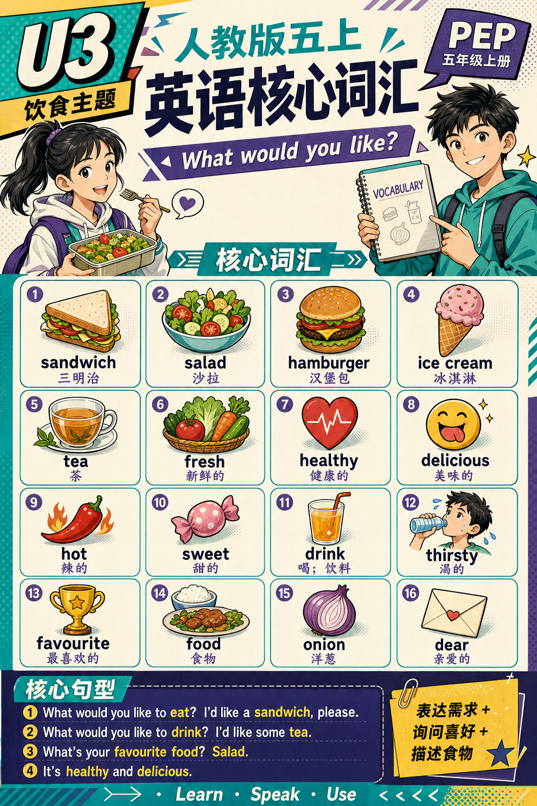

# 英语学习资料

[English](./README.md) | 中文

根据指定教材和单元，制作经过来源核验的“词汇复习海报”或“单元复习海报”。这个 Skill 把教材检索、确定性内容选择、模块锁定、年龄适配、纯生图和交付验收串成可复用流程，默认生成完整位图。

适合教师、家长、辅导老师、课程创作者和学习资料团队，尤其适用于需要单张或批量制作、又不希望凭记忆猜测教材内容的场景。

## 预览









这些已生成案例在文件存在且运行时支持图片输入时，默认作为风格与版式参考，用于控制色彩、栏目比例、信息密度和装饰节奏。其中的教材文字、品牌标识、人物和具体配图不作为可复用内容模板。案例图不可用时，Skill 会自动回退到该主题的完整文字视觉 DNA，不阻塞生成。

## 它能做什么

Skill 会先核验教材身份和单元标题，再按资料类型执行内容契约，把成品分区整理进 Markdown 清单并生成最终成品内容确认卡；经过两次明确确认后逐张生图，并在交付前检查可见文字、配图语义与年龄适配。

## 核心能力

| 能力 | 它能帮你做什么 |
|---|---|
| 教材核验 | 确认出版社、版本、年级、册次、单元和标题，并保留可检查来源 |
| 最新版本门禁 | 每个新任务重新核验当前适用版本，防止因旧版资料更多而静默回退 |
| 有来源的内容清单 | 把词汇、译义、句型、版式和证据集中到一份可追溯文件 |
| 资料类型内容契约 | 防止单元复习海报悄悄退化成只有词汇的清单 |
| 跨电脑稳定契约 | 固定两种模式、25/20/16/12/9 词汇档位、句型与知识提示组数，并禁止额外模块 |
| 成品化确认卡 | 生图前确认标题、词汇配图、句型、知识提示、成品分区和页数 |
| 弹性版面预检 | 按主题、网格和文字长度提示信息负荷；支持自动适配、拆页或用户确认单页尝试 |
| 旧清单再生门禁 | 历史成品仍可验收；旧版清单重新生图前必须迁移到最新契约并重新确认 |
| 年龄适配 | 根据学习阶段调整人物、场景、色彩成熟度、装饰、字体和信息密度 |
| 高年级年龄硬锁 | 防止小学高年级、初中和高中人物漂移成幼儿、Q版或小学低年级比例 |
| 四套内置主题 | 选择手绘童趣、校园杂志风、现代学习手账风、少年漫画海报风，或提供自己的参考图 |
| 参考图优先判断 | 有用户图或内置案例图时默认参考其版式；没有可读图片时自动回退详细文字视觉 DNA |
| 默认纯生图 | 使用当前 Agent 的原生图片生成能力制作完整视觉图片 |
| 首张就绪度门禁 | 调用图片模型前解决运行时画布、模块与风格冲突、插图文字风险、人物年龄线索和清单—任务包过期问题 |
| 区域化文字计划 | 为标题、用户可见模块名称和学习内容绑定区域与出现次数，生图前移除标题拼接别名 |
| 插图表面文字锁 | 统一禁止衣服、书本、屏幕、标牌、机器人、包装等道具擅自出现字母、数字、徽标、品牌或口号 |
| 生成次数控制 | 首次只生成一张预期成品；记录硬失败后最多定向重试一次，第三次必须取得明确同意 |
| 单张或批量 | 为一个单元制作单张资料，或为多个单元建立独立清单与图片 |
| 质量门禁 | 检查确认状态、来源、文字白名单、图片数量、拼写和语义对应关系，并使用原图逐区视觉复核 |

## 平台兼容性

Skill 采用可移植的 Markdown 指令和 Python 标准库脚本。只要当前 Agent 具备联网检索、图片生成和图片查看能力，即可用于 Codex、Claude Code 和 OpenClaw；脚本支持安装了 Python 3.10 及以上版本的 macOS 和 Windows。

## 安装

把下面这句话发送给你的 Agent：

```text
帮我安装这个 Skill：
https://github.com/chemny/english-learning-materials
```

Agent 会根据当前客户端完成安装、依赖检查和加载验证。

## 快速开始

```text
使用英语学习资料 Skill，为人教版 PEP 四年级上册 Unit 1 制作一张单元复习海报。主体精确锁定为核心词汇、核心句型、知识提示三个模块。选择手绘童趣风格，根据年级自动推断年龄段，并保持默认纯生图。
```

流程会先暂停确认教材身份，再暂停确认最终内容清单、页面方案、视觉风格和年龄适配。

## 使用示例

- 为指定教材单元制作一张词汇复习海报。
- 为多个单元批量生成视觉体系一致的复习卡。
- 为同一单元分别制作词汇复习海报和三模块单元复习海报。
- 使用上传图片作为视觉参考，但不复制其中的文字、人物或品牌。
- 当学生实际年龄与教材年级不一致时，覆盖自动推断的学习者阶段。

## 工作流程

1. 收集资料类型、教材身份、输出尺寸、视觉风格和学习者信息。
2. 从可检查来源核验教材和单元，并由用户确认教材身份。
3. 建立清单版本 4 的 `material-manifest.md`，记录完整候选池、确定性入选结果、固定主体模块、文字白名单、版式和年龄配置。
4. 按主题、版式和文字长度执行容量预检；`review` 只提示风险，明显超载时选择自动适配、拆页或用户确认单页尝试。
5. 生成并确认与最终海报分区一致的成品内容确认卡。
6. 使用随附的 Python 脚本校验清单，并把文字编译成绑定区域与次数、保留已确认模块显示名称、自动移除标题拼接别名且记录来源清单文件指纹的 `generation-package.md`。
7. 运行 `generation_preflight.py`；所有硬项通过、首张就绪度达到 90/100，且任务包仍与当前来源清单一致后才能生图。
8. 为每份清单首次只生成一张预期成品；只有记录硬验收失败后才进行一次定向重试。
9. 交付前使用原图逐区视觉检查，核对拼写、重复或越界文字、配图对应、分区一致性、年龄适配和批量一致性。

## 仓库结构

```text
.
├── SKILL.md
├── agents/
│   └── openai.yaml
├── assets/
│   ├── readme/
│   │   └── preview-handdrawn-unit2.png
│   └── style-references/
│       ├── asset-manifest.json
│       ├── campus-magazine-v1.png
│       ├── modern-study-journal-v1.png
│       ├── primary-handdrawn-fresh-v2.png
│       └── youth-comic-poster-v1.png
├── references/
│   ├── age-adaptation.md
│   ├── content-contracts.md
│   ├── manifest-schema.md
│   ├── qa-checklist.md
│   ├── source-policy.md
│   ├── style-campus-magazine-v1.md
│   ├── style-modern-study-journal-v1.md
│   ├── style-primary-handdrawn-v1.md
│   ├── style-presets.md
│   └── style-youth-comic-poster-v1.md
├── scripts/
    ├── age_profiles.py
    ├── build_generation_package.py
    ├── check_layout_capacity.py
    ├── content_contract.py
    ├── generation_preflight.py
    ├── init_material_job.py
    ├── render_confirmation_card.py
    ├── validate_batch.py
    ├── validate_output_images.py
    ├── verify_reference_assets.py
    └── validate_manifest.py
└── tests/
    ├── test_content_contract_v4.py
    └── test_generation_preflight.py
```

## 使用要求

- 当前 Agent 能够检查网页来源，或读取用户提供的教材页面。
- 当前 Agent 具备原生或已连接的图片生成能力。
- 使用 Python 3.10 及以上版本运行任务初始化与清单校验脚本。
- 安装时能够访问 GitHub。

仓库不保存 API 密钥，也不打包教材扫描件、复制的课文页面或用户上传的参考图片。

随附案例属于优先但非必要的视觉参考。存在且当前运行时支持图片输入时，Skill 默认使用其版式、层级、配色、密度和装饰节奏；不可用时继续使用已注册的文字视觉 DNA 和固定风格提示词。

## 许可证

本项目采用 [MIT License](./LICENSE)。教材内容、产品名称和用户提供的材料仍受各自权利及合理使用边界约束。
